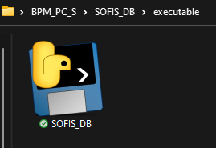
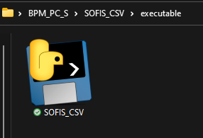

#  Stack OverFlow Issues Searcher - SOFIS

SOFIS fetches discussions from StackOverflow on a given topic using the StackOverflow API, **consults issues that have been created as of 14/01/2014**, and stores the results in a PostgreSQL database or local CSV file.

## Index

1. [Description](#description)
2. [Prerequisites](#prerequisites)
3. [Usage](#usage)
4. [Development Summary](#development-summary)
5. [API Usage Limitations](#api-usage-limitations)
6. [Future Improvements](#future-improvements)

## Description

**SOFIS** allows you to retrieve StackOverflow issues based on a specified search topic as of 01/14/2014. There are two versions of SOFIS available:

- **SOFIS_CSV**: This version generates a CSV file with the obtained results.
- **SOFIS_DB**: This version uses a PostgreSQL database to store the obtained results.

***If you facing the choice between SOFIS_CSV and SOFIS_DB for your StackOverflow data needs, it's crucial to carefully assess your requirements before making a decision. SOFIS_CSV offers a swift and portable solution, enabling you to retrieve and store StackOverflow discussions in CSV format, sidestepping the intricacies of setting up a database; this option is ideal for straightforward analysis and seamless collaboration. In contrast, SOFIS_DB, built on PostgreSQL, provides greater power to handle substantial data volumes and in-depth analysis. The recommendation leans towards SOFIS_CSV if you're seeking a direct and efficient approach to obtain and share relevant information.***

## Prerequisites
Before running SOFIS, ensure that you have the following prerequisites installed:

1. **Code editor**: If you want to modify to SOFIS you must have, we recommend using Visual Studio Code (VS Code). You can download it from the [official website](https://code.visualstudio.com/download).
2. **Version control system**: Install GIT from the [official website](https://git-scm.com/downloads).
3. **Clone the repository**: Use the following command to clone the repository: `git clone https://github.com/BPMN-sw-evol/SOFIS.git`.
4. **Python**: Install Python from the [official website](https://www.python.org/downloads/) or install the Python extension in VS Code.
5. **Required Python modules**:
   - requests (for making HTTP requests): `pip install requests`
   - psycopg2-binary (only for SOFIS_DB version): `pip install psycopg2-binary`

If you plan to use the PostgreSQL version (SOFIS_DB), follow the steps below:

6. **Install PostgreSQL**: Download and install the stable or latest version from the [official PostgreSQL website](https://www.postgresql.org/download/).
7. **Using pgAdmin 4** (included with PostgreSQL), create a database called `SOFIS`.
8. **Create the required table**: In the `SOFIS` database, execute the `SOFIS_Query.sql` script to create the required table. The script is available in the repository.

   ````sql
   CREATE TABLE SOFIS_QUERY (
      id_discussion SERIAL PRIMARY KEY,
      topic VARCHAR(25),
      title VARCHAR(255),
      link VARCHAR(255),
      score INTEGER,
      answer_count INTEGER,
      view_count INTEGER,
      creation_date DATE,
      tags VARCHAR(255)
   );
   ````
9. **API_KEY**: To use the StackOverflow API and make requests, you will need an API key. Follow the steps below to obtain the necessary credentials:
   - Register an account at [Stack Apps](https://stackapps.com/users/login).
   - Register your application to obtain the API credentials at [Stack Apps - Register an Application](https://stackapps.com/apps/oauth/register).
   - Obtain a client ID and a secret key for OAuth authentication on Stack Overflow.   

## Usage

To execute SOFIS, use one of the 3 ways the program can be execute:

1. To execute the Python script, use the following command in the terminal or command prompt:

   - **For SOFIS_DB:**
      
      
         python SOFIS_DB.py -k "YOUR_API_KEY" -i "search_topic" -d "SOFIS" -u "postgres" -p "1234" -f "12-06-2023"

   - **For SOFIS_CSV:**
      

         python SOFIS_CSV.py -k "YOUR_API_KEY" -i "search_topic" -u "12-06-2023" -d "\desired\path"

2. Alternatively, you can use the provided batch file to execute SOFIS. Open the terminal or command prompt and run the following command:
   - **For SOFIS_DB:**
      
      
         .\SOFIS_DB.bat -k "YOUR_API_KEY" -i "search_topic" -d "SOFIS" -u "postgres" -p "1234" -f "12-06-2023"

   - **For SOFIS_CSV:**
      

         .\SOFIS_CSV.bat -k "YOUR_API_KEY" -i "search_topic" -u "12-06-2023" -d "\desired\path"

3. For Windows users, you can directly run the provided executable file. Simply double-click on the "SOFIS_*.exe" file to execute the program:

   - **For SOFIS_DB:**
      
      
         cd .\executable\

         .\SOFIS_DB.exe

   - **For SOFIS_CSV:**
         

         cd .\executable\

         .\SOFIS_CSV.exe


**Replace the placeholder values with your specific information.**

If there are no errors, the program will save the data while discarding discussions with negative votes (less than zero). It also performs validation to avoid duplicates in the database or CSV file.

To verify the data, execute the following SQL statement in pgAdmin 4:

      SELECT \* FROM SOFIS_QUERY WHERE title ILIKE '%search_topic%';

**When you execute the ".py" or ".bat" files to store issues in a CSV format, a corresponding "SQ.pars.<"issue">.txt" file will be created. This file will store the params of the last query performed for a specific issue.**

## Development Summary

SOFIS utilizes the StackOverflow API to retrieve discussions related to a specified search title. It stores these discussions in a local database using PostgreSQL or CSV file. SOFIS checks if each discussion already exists in the database or CSV file and, if not, and it has a score greater than or equal to zero, it inserts it. Additionally,  provides information on the number of questions found, inserted, skipped due to negative votes, and skipped due to already existing in the database or CSV file.

The database or CSV file stores the following attributes for each discussion:

| Attribute     | Description                          |
| ------------- | ------------------------------------ |
| id_discussion | Unique identifier of the discussion  |
| title         | Title of the discussion              |
| link          | Link to the StackOverflow website    |
| score         | Score of the discussion              |
| answer_count  | Number of answers for the discussion |
| view_count    | Number of views for the discussion   |
| creation_date | Creation date of the discussion      |
| tags          | Tags related to the discussion       |

The development focuses on searching for discussions within StackOverflow whose titles contain the specific platform requested as a parameter. This approach ensures that the obtained data is more contextually relevant to the target platform.

## API Usage Limitations

The StackOverflow API has the following limitations:

1. Maximum 30 requests per second.
2. Maximum 10,000 requests per day.
3. If the daily limit is exceeded, an HTTP 429 error will be returned.
4. The daily request limit is renewed from the next midnight.

## Future Improvements

1. Implement a cloud-based database for improved scalability and accessibility.
2. Add functionality to update records individually or specific records based on user requirements.
