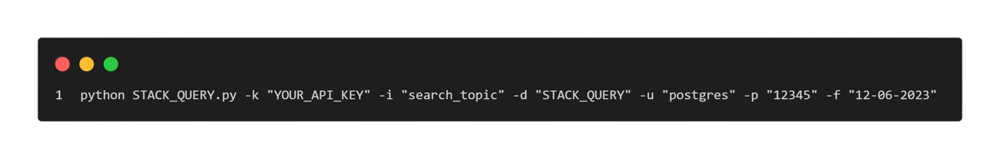
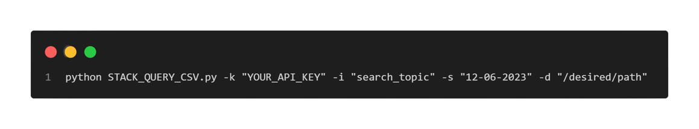

# STACK_QUERY

This program fetches discussions from StackOverflow on a given topic using the StackOverflow API and stores the results in either a PostgreSQL database or local CSV files.

## Índice

1. [Description](#description)
2. [API](#api)
3. [Prerequisites](#prerequisites)
4. [Usage](#usage)
5. [Development Summary](#development-summary)
6. [API Usage Limitations](#api-usage-limitations)
7. [Future Improvements](#future-improvements)

## Description

STACK_QUERY is a program that allows you to retrieve discussions from StackOverflow based on a specified search topic. It provides two versions:

- *STACK_QUERY_CSV*: This version generates a CSV file with the obtained results.
- *STACK_QUERY_DB*: This version uses a PostgreSQL database to store the obtained results.

## API

To use the StackOverflow API and make requests, you will need an API key. Follow the steps below to obtain the necessary credentials:

1. Register an account at [Stack Apps](https://stackapps.com/users/login).
2. Register your application to obtain the API credentials at [Stack Apps - Register an Application](https://stackapps.com/apps/oauth/register).
3. Obtain a client ID and a secret key for OAuth authentication on Stack Overflow.

## Prerequisites
Before running the program, ensure that you have the following prerequisites installed:

1. *Code editor*: We recommend using Visual Studio Code (VS Code). You can download it from the [official website](https://code.visualstudio.com/download).
2. *Version control system*: Install GIT from the [official website](https://git-scm.com/downloads).
3. *Clone the repository*: Use the following command to clone the repository: `git clone https://github.com/danilonunezgil/BPM_PC_S.git`.
4. *Python*: Install Python from the [official website](https://www.python.org/downloads/) or install the Python extension in VS Code.
5. *Required Python modules*:
   - requests (for making HTTP requests): `pip install requests`
   - psycopg2-binary (only for STACK_QUERY_DB version): `pip install psycopg2-binary`

If you plan to use the PostgreSQL version (STACK_QUERY_DB), follow the steps below:

6. *Install PostgreSQL*: Download and install the stable or latest version from the [official PostgreSQL website](https://www.postgresql.org/download/).
7. *Using pgAdmin 4* (included with PostgreSQL), create a database called `STACK_QUERY`.
8. *Create the required table*: In the `STACK_QUERY` database, execute the `BPM_PC_Query.sql` script to create the required table. The script is available in the repository.

   sql
   CREATE TABLE BPM_PC_QUERY (
      id_discussion SERIAL PRIMARY KEY,
      topic VARCHAR(25),
      title VARCHAR(255),
      link VARCHAR(255),
      score INTEGER,
      answer_count INTEGER,
      view_count INTEGER,
      creation_date DATE,
      tags VARCHAR(255)
   );
   

## Usage

To execute the program, use the following command in the terminal or command prompt:

- *For STACK_QUERY:*
   

- *For STACK_QUERY_CSV:*
   

Replace the placeholder values with your specific information.

If there are no errors, the program will save the data while discarding discussions with negative votes (less than zero). It also performs validation to avoid duplicates in the database.

To verify the data, execute the following SQL statement in pgAdmin 4:

SELECT \* FROM BPM_PC_QUERY WHERE title ILIKE '%search_topic%';

## Development Summary

This program utilizes the StackOverflow API to retrieve discussions related to a specified search title. It stores these discussions in a local database using PostgreSQL. The program checks if each discussion already exists in the database and, if not, and it has a score greater than or equal to zero, it inserts it. Additionally, the program provides statistics on the number of questions found, inserted, skipped due to negative votes, and skipped due to already existing in the database.

The database stores the following attributes for each discussion:

| Attribute     | Description                          |
| ------------- | ------------------------------------ |
| id_discussion | Unique identifier of the discussion  |
| title         | Title of the discussion              |
| link          | Link to the StackOverflow website    |
| score         | Score of the discussion              |
| answer_count  | Number of answers for the discussion |
| view_count    | Number of views for the discussion   |
| creation_date | Creation date of the discussion      |
| tags          | Tags related to the discussion       |

The development focuses on searching for discussions within StackOverflow whose titles contain the specific platform requested as a parameter. This approach ensures that the obtained data is more contextually relevant to the target platform.

## API Usage Limitations

The StackOverflow API has the following limitations:

1. Maximum 30 requests per second.
2. Maximum 10,000 requests per day.
3. If the daily limit is exceeded, an HTTP 429 error will be returned.
4. The daily request limit is renewed from the next midnight.

## Future Improvements

1. Implement a cloud-based database for improved scalability and accessibility.
2. Add functionality to update records individually or specific records based on user requirements.
